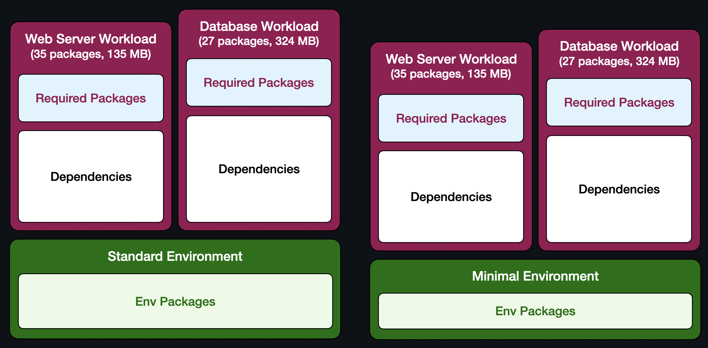
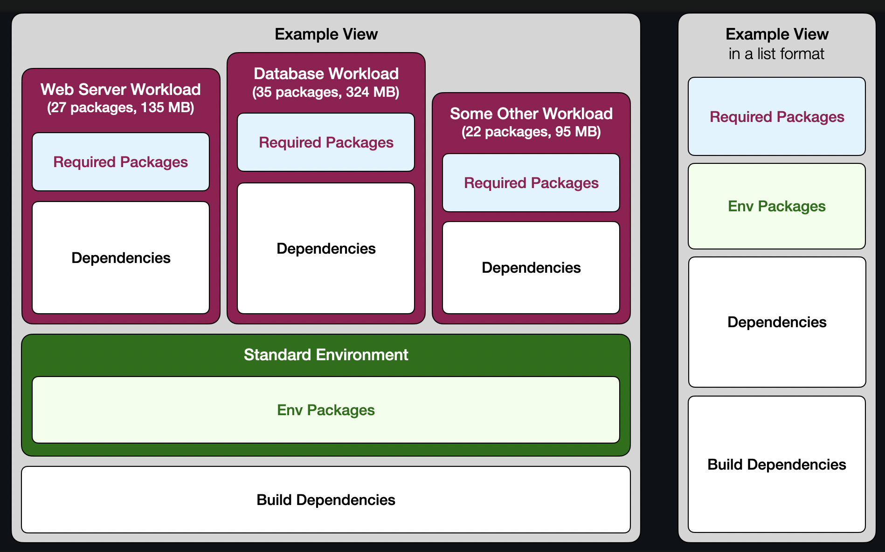

# Content Resolver

Content Resolver makes it easy to define and inspect package sets of RPM-based Linux distribution.

You define what packages you need, and Content Resolver gives you the whole picture including all the dependencies. And it keeps it up-to-date as packages get updated over time.

This works across a wide range of environments. It will handle anything from a single person wanting to see how big a web server installation is up to dozens of independent teams comprised of hundreds of people defining an entire Linux distribution, including the entire set of build dependencies and their ownership recommendation.

Content Resolver also helps with minimisation efforts by showing detailed dependency information, flagging certain packages as unwanted, and more.

[See it live! (https://tiny.distro.builders)](https://tiny.distro.builders)

## Using Content Resolver

### Controlling Content Resolver

Content Resolver is entirely controlled by a set of YAML files stored in a git repository. Changes to the content can easily be modified and reviewed via pull requests.

[See Fedora's input repository](https://github.com/minimization/content-resolver-input)

### Main concepts



*Workloads* are the primary reason for Content Resolver's existence, representing a package set with a specific purpose — an application, a runtime, a set of dependencies for a specific use case, etc.

Workloads consist of two parts:
* Required Packages — defined by the user
* Dependencies — resolved by Content Resolver

Workloads are resolved on top of *Environments* which are meant to represent environments in which workloads would typically run — container base images, cloud images, or even desktop installations.

Similar to workloads, environments consist of the same two parts:
* Required Packages — defined by the user
* Dependencies — resolved by Content Resolver

Environments are fully resolved first, and workloads are then resolved on top of them.

*Repositories* are the sources of packages Content Resolver uses to resolve Workloads and Environments.

Finally, everything is connected by *Labels*. Workloads are resolved on top of environments with the same label, using repositories with (you guessed it!) the same label.

### Views



*Views* are an advanced concept that combines multiple workloads into a single view.

Views can serve many purposes, but the primary reason for their existence is [Fedora ELN](https://docs.fedoraproject.org/en-US/eln/). Multiple contributors are able to define a subset of Fedora Rawhide to be rebuilt with Enterprise Linux flags.

For this, Content Resolver can do additional things with Views:
* resolve build dependencies
* show detailed reasons behind the presence of every package
* make recommendations for the primary maintainer of shared dependencies
* mark and track unwanted packages

### Build Dependencies (draft)

Content Resolver can resolve build dependencies for views, showing what needs to be in the buildroot in order to rebuild the entire view, including all the build dependencies themselves.

This way, the entire set (required packages + runtime dependencies + build dependencies) is self-hosting (capable of rebuilding itself).

Build dependencies are currently resolved in an external service (dep-tracker) because every SRPM (source package) needs to be rebuilt for all architectures. That's necessary because dependencies can vary across different architectures. And unlike with RPMs (binary packages), SRPMs are not distributed per-architecture, as their primary use case is to distribute the sources rather than provide dependency information.

Current limitations: Because the build dependencies are resolved by an external service, the results might lag as much as several hours behind the runtime views. There is also currently no distinction between direct build dependencies and dependencies of build dependencies in on the package details page.

There's [work being done (#27)](https://github.com/minimization/content-resolver/issues/27) to change the way build dependencies are resolved (using data from Koji rather than the SRPMs themselves) that will remove the current limitations.

### Reasons of Presence

To make minimisation of a set defined by a view easier, each package gets its own detail page.

This page includes information about what workloads pull it in and who owns that workload, as well as package-level dependencies, both runtime and build.

### Unwanted Packages

Another way to make minimisation easier is the ability to track unwanted packages.

Maintainers can flag certain packages as unwanted. That causes these packages to be highlighted (if they're present in the set), and they are also listed on dedicated page.

In combination with Reasons of Presence, this helps maintainers identify what dependencies need to be cut in order to remove the unwanted packages.

Current limitations: There's currently only a single level of unwanted packages. But there's [work being done (#28)](https://github.com/minimization/content-resolver/issues/28) to allow additional levels, such as a distinction between "unwanted in the runtime set" vs. "unwanted in buildroot as well".

### Maintainer recommendation

Because views are defined by multiple parties, it's not always clear who should be responsible for owning shared dependencies.

That's why Content Resolver helps identify who pulls each package into the set "the most" and recommends ownership based on that.

Current limitations: Content Resolver doesn't look at anything else, just the dependencies and who pulled it in. But parties can volunteer to own a package. In that case, Content Resolver should be able to see that and show that instead. There's [work being done (#29)](https://github.com/minimization/content-resolver/issues/29) that will allow maintainers to accept a package, allowing Content Resolver to use this information when recommending owners.

## Running Content Resolver

Content Resolver is designed to be highly available without needing the operator to run critical infrastructure.

The input is consumed from a git repository. This allows the use of existing services such as GitHub.

The output is just a set of static HTML pages. This allows it to be served from CDNs using services such as AWS S3.

Lastly, there is a script that reads the input and regenerates the output. This can be run as a periodic job on any appropriate system. Notably, this script only refreshes the output, meaning that it doesn't need to be kept running for the service to be available and that upgrades and maintenance of the Content Resolver won't result in down-time of the resolved views.

Please use the `refresh.sh` script as a reference for deployment.

## Contributing to Content Resolver (TBD)

## Developer preview

If you want to contribute and test your changes, run the `feedback_pipeline.py` script with test configs in the `test_configs` directory.

To run the script, you'll need Python 3 and the following dependencies:

* `yaml`
* `jinja2`

### Option 1: on Fedora in a container

```
$ podman build . -t content-resolver-env
$ podman run --rm -it --tmpfs /dnf_cachedir -v $(pwd):/workspace:z content-resolver-env bash
```

... which starts a shell in the container. And inside the container:

```
# mkdir -p output/history
# ./feedback_pipeline.py --dnf-cache-dir /dnf_cachedir test_configs output
```

The output will be generated in the `output` directory. Open the `output/index.html` in your web browser of choice to see the result.

### Option 2: on a Mac using Docker:

```
$ docker build . -t content-resolver-env
$ docker run --rm -it --tmpfs /dnf_cachedir -v $(pwd):/workspace content-resolver-env bash
```

... which starts a shell in the container. And inside the container:

```
# mkdir -p output/history
# ./feedback_pipeline.py --dnf-cache-dir /dnf_cachedir test_configs output
```

The output will be generated in the `output` directory. Open the `output/index.html` in your web browser of choice to see the result.
